# Mistbox — the box builder, in screenshots

Every shot is from the running app, captured by `node tools/screens.mjs`
and labelled by `python3 tools/annotate.py`. Re-run both to refresh.

> Item names, makers, weights and photography are **placeholders** until the
> real Seattle Chocolate, Franz and Smith Tea catalogues arrive.

## Shop — what a visitor sees

**Three boxes, one built in Saleor**

The Afternoon Box was composed in the dashboard — no code, no re-seed — and appeared here on its own.

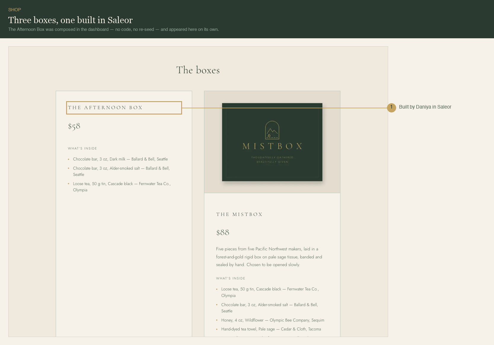

## Build — choosing what goes in the box

**The curated box is the starting state**

Nothing to configure. A customer who changes nothing gets exactly what the shop photographed.

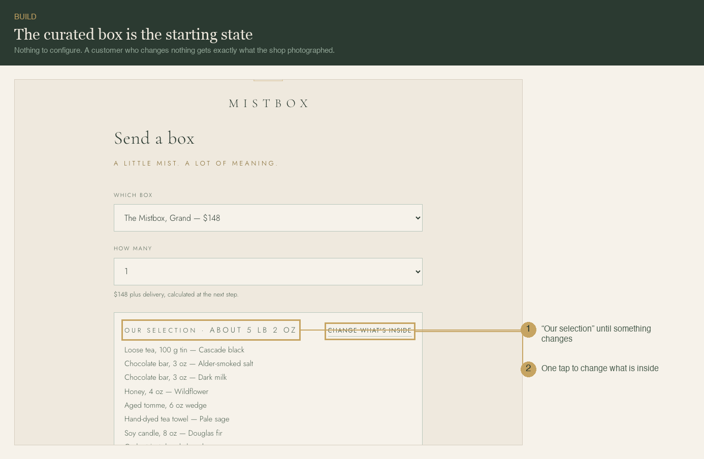

**Every slot is editable in place**

Change the item, or keep the item and change its flavour. Same gesture, two depths.

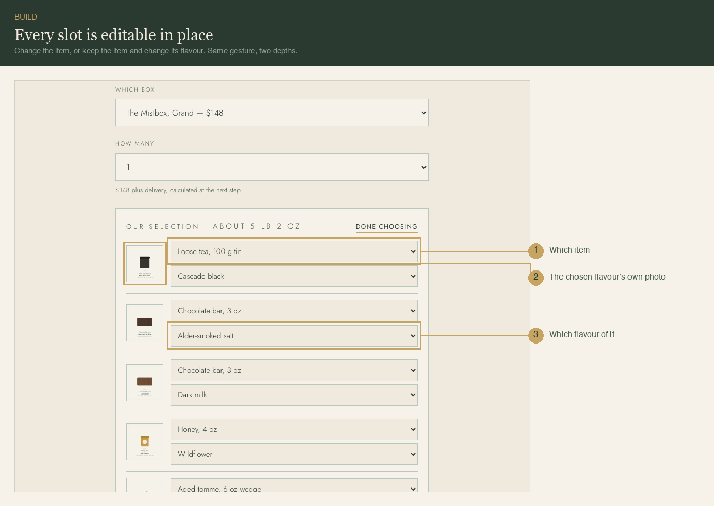

**Swapping updates the weight, live**

A tea became a candle, so the parcel got heavier. The number is summed from real per-variant weights.

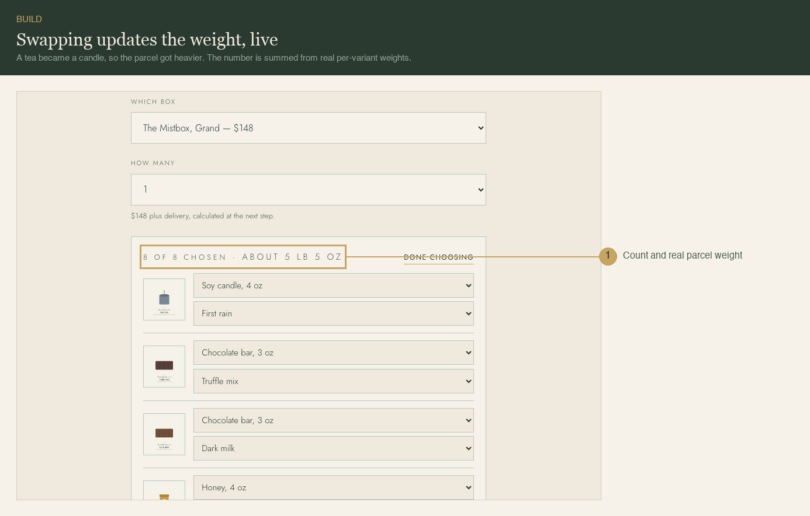

## Limits — what the builder will not allow

**Caps are per product, across flavours**

Two chocolate bars is the limit, so the item greys out elsewhere — a box cannot become five bars.

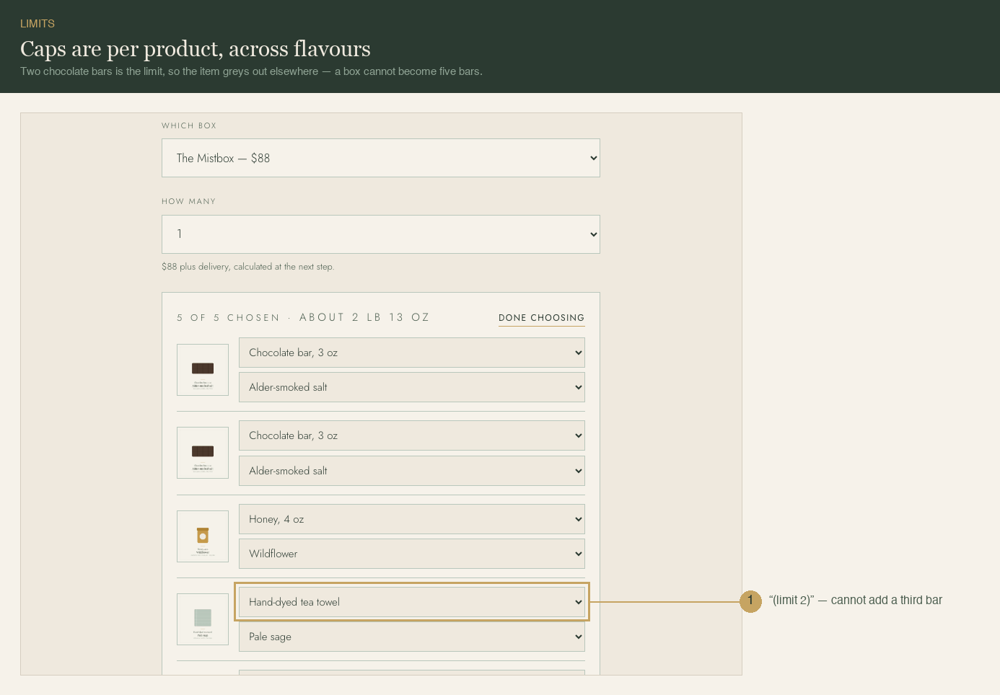

## Receipt — what the buyer gets back

**Details stay behind the buyer’s email**

Status and tracking are open to anyone with the link; prices, address and gift message are not.

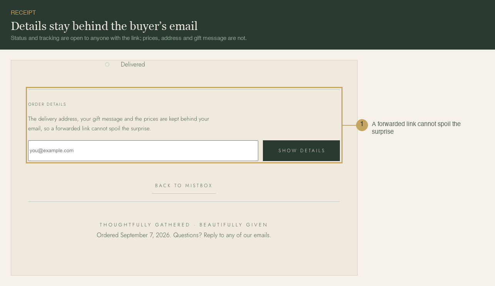

**The box is priced; its contents are named**

Items ride at zero, so they are listed rather than printed as “$0.00” beside a hand-made bar.

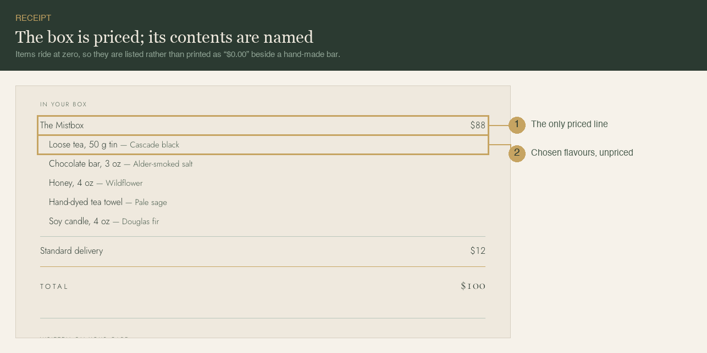

## Email — the confirmation

**The confirmation carries the same split**

Same rule as the receipt: one priced box, its contents named beneath it.

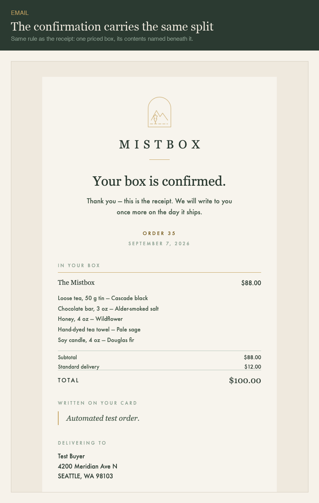

## Pack — Daniya's screen

**A packing checklist, not a run-on**

Carton first, then every item with its chosen flavour and SKU — readable while holding a box.

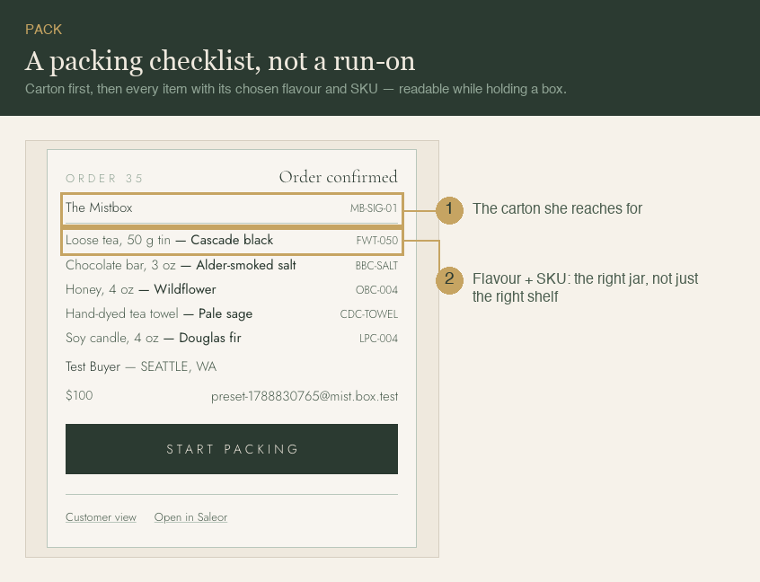

**Buying the shipping label**

One tap quotes a real carrier price; a second tap spends it. Nothing is bought without seeing the number.

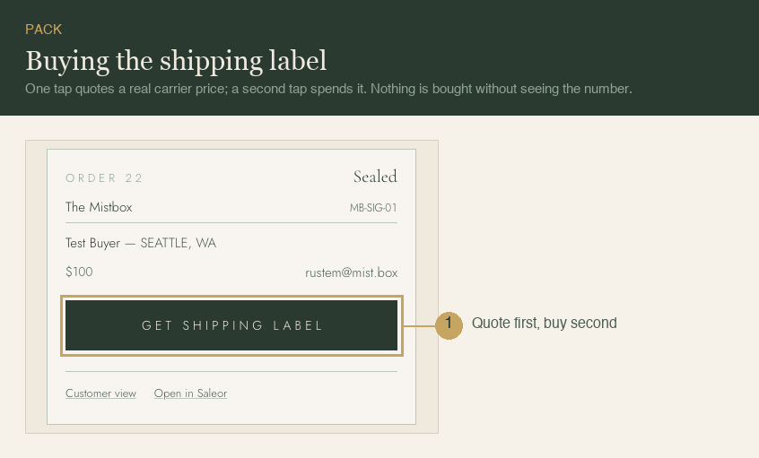

## Dashboard — Saleor, where boxes and items are managed

**A flavour is a variant, not a product**

Saleor’s own model — SKU and stock live on the variant. Adding a scent is adding a variant, which is why the product is the swap group.

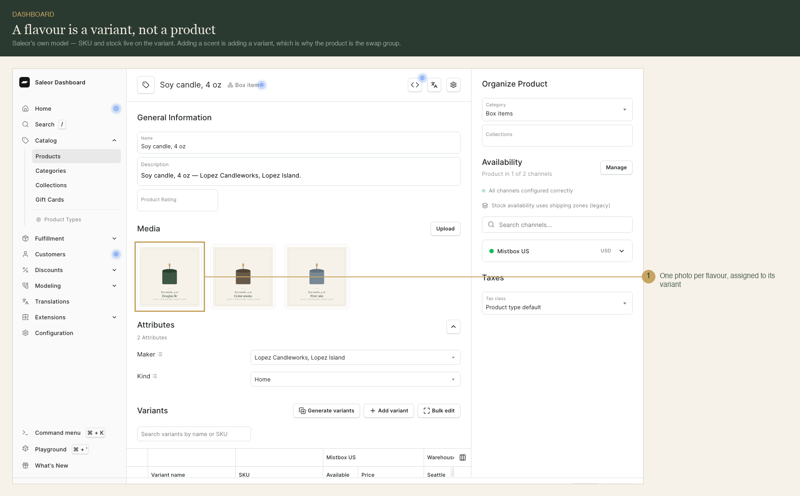

**Composing a box from items**

The Contents picker is how Daniya builds a box. What she picks becomes the order lines, the stock that moves, and the site copy.

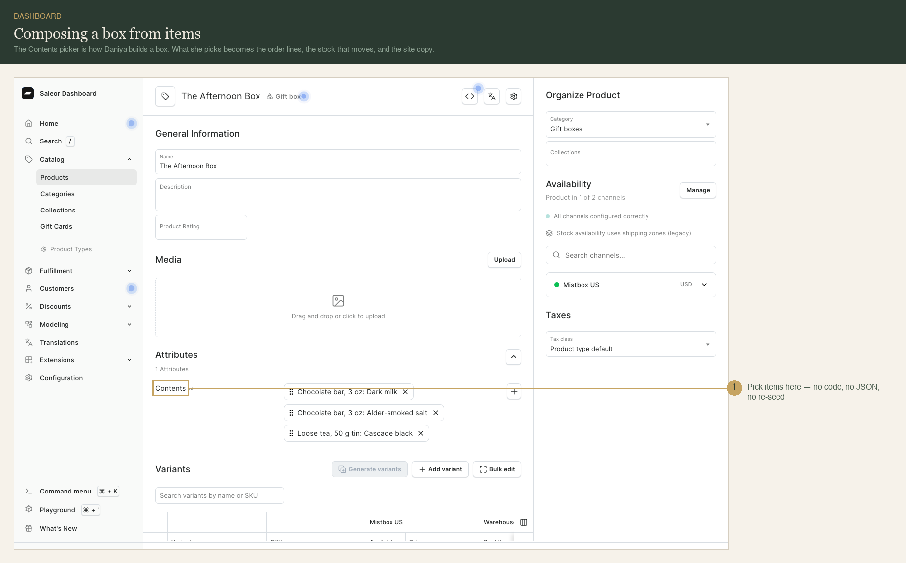
